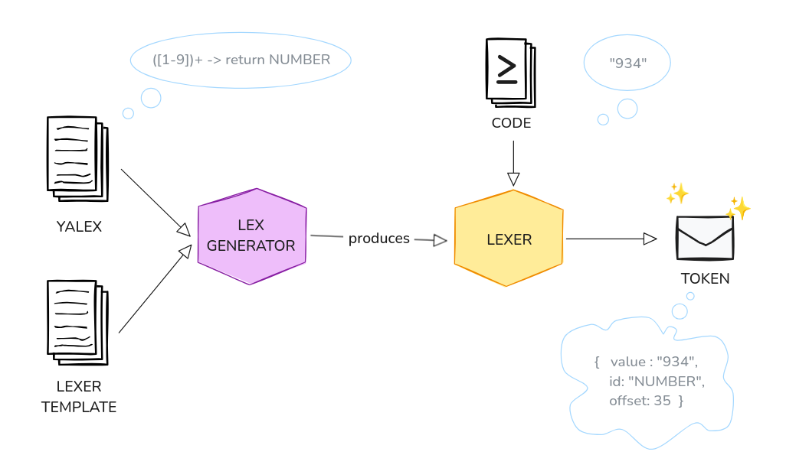
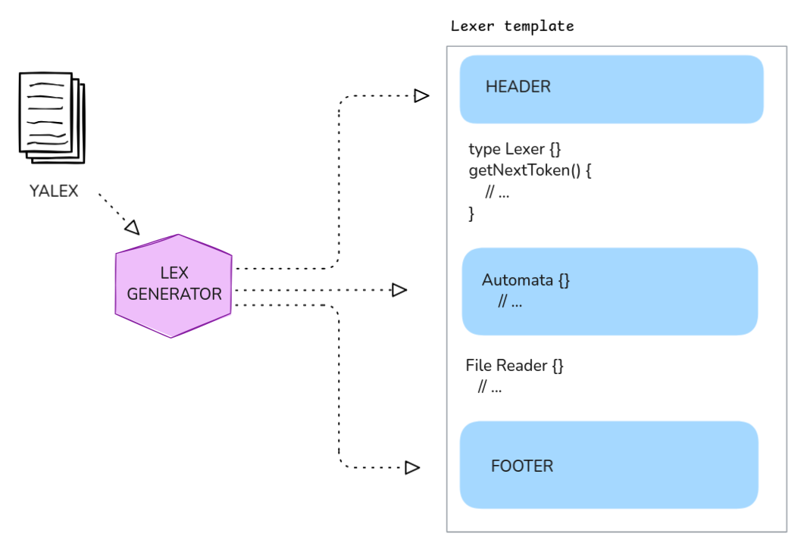
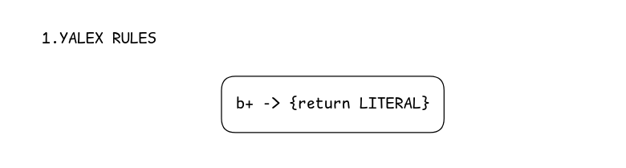
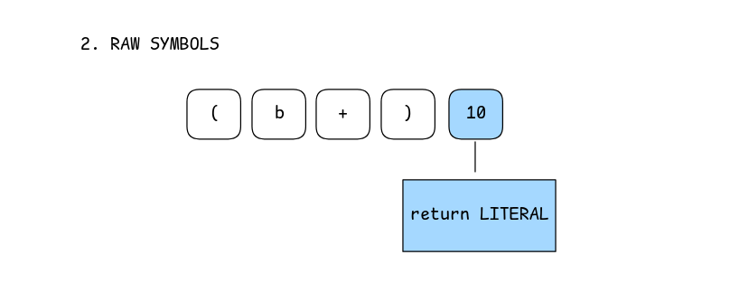
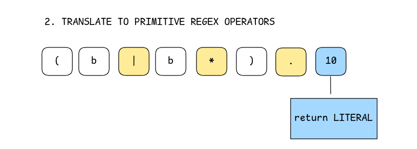
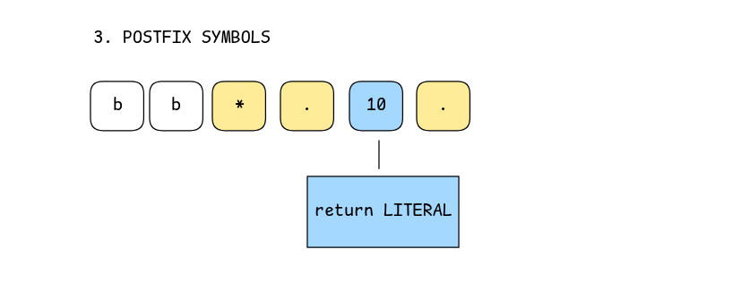
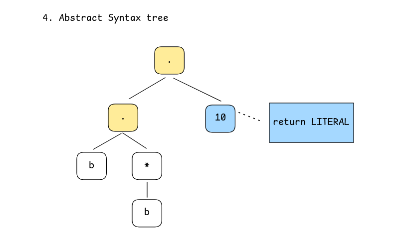
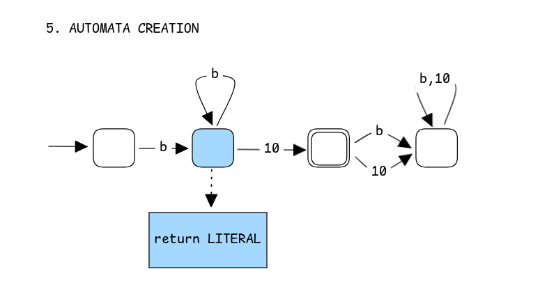
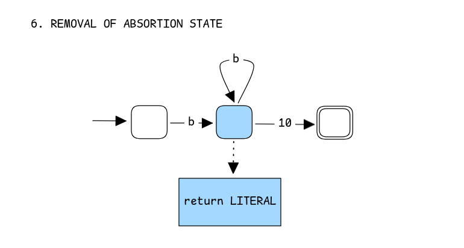

<h1 align="center">YAAALex 🚀</h1>
<h3 align="center">(Yet Another Another Lexer Generator)</h3>

Hi! This project aims to be an educational implementation of a **Lexer Generator** following a Lex-like sintax to configure it. 

It uses a **Deterministic Finite Automata(DFA)** for Regex Patterns recognition. Down below, there will be more explanation about the actual pipeline the inputs suffer in order to recognize tokens.

## Getting Started 🎬

```bash
task build                              // Builds YAAAlex app
task run <YALex file> <Output path>     // Runs YAAAlex with an definition file and and output file
task testLex <YALex file >              // Builds and compiles a lexer file, and run it with a dummy main.
task test                               // Run tests
task clean                              // Removes executables
```

## The YALex File 📄
Since YALex initial definition was meant for C, we tweak it a little bit to be easer to work with using Go. Below is the structure for a YALEX go file. You can find more examples on `examples/`

```
// Use "//" for comments
%{ 
    // ======= HEADER =======
    // The entire contents of this section will be COPIED to the BEGINING of the generated Lexer.go file
    
    
        //  ------ TOKENS ID -----
        // Definition of the possible token types the compiled lexer can output, this wil be later
        // used for the action definition when a pattern is matched.

        const (
            LITERAL = iota
            NUMBER
            COND 
        )
%}
{
    // ====== NAMED PATTERNS =======
    // Definition 
    // - A Pattern should be defined in a single line
    // - Use "{}" to refer to Named patterns defined before
    // - use "\" to scape "{}" if you want them within a Regex expresion

    let LETTER = [a-zA-Z]
    let DIGIT = [0-9]
    let ID = {LETTER}({LETTER}|{DIGIT})*  // ID is a combination of LETTER and DIGIT
    let NUMBER = {DIGIT}+  // A NUMBER consists of one or more DIGITS
    let WS = {DIGIT}+  // A NUMBER consists of one or more DIGITS
} 

// ======= RULES ========
// Define how to react when certain patterns are matched.
// All Rules are composed by a "pattern" and an "action".
// The action, is ANY GO CODE that will be executed when the lexeme is recognized
// - They may end with a return statement using any ID defined in the TOKENS ID section
// - If there is not return statement, the Lexer wont yield any token when that pattern is matched.
// - Use "{}" to refer to named patterns defined before

%%
{LETTER} {return LETTER}      // PRIORITY 0
{DIGIT} {return DIGIT}        // PRIORITY 1
{COND} {return DIGIT}         // PRIORITY 2
' ' {return WS}               // ...
{LETTER} { return LITERAL }
%%

// NOTE:
// The order in which they are written also defines ITS PRIORITY. 
// If the lexer happens to recognize 2 possible actions for a pattern it will take 
// the one with HIGHEST PRIORITY (declared first here).

%{
    // ======== FOOTER =======
    // The entire contents of this section will be COPIED to the END of the generated Lexer.go file
%}
```

## The General Pipeline
A lexer is a piece of software that can identify patterns in an input, and tell:

> *"Hey, this '934' its a NUMBER according to the Regex Pattern tu told me."*

It reports this information in the shape of a **Token** which is a a data structure, that other programs can work with.

It turns out that all lexers share many components, **making easy to standarize them** an build a Lexer Generator, this is what our Yaalex do! The general flow, consist on:

1. Providing a Yaalex definition WHICH specifies all the patterns the lexer will recognize, and HOW to react when encounter them.
2. A template, which contains the common pieces all lexers share (check ours at `/template`).
3. The generator takes those definitions and builds a functional `lexer.go` file
4. Provide the `lexer.go` a code to tokenize, and fetch the tokens.



### The componentes of a Lexer
So before building a generator we first have to understand what we are generating.

A lexer is basically conformed by 4 parts:
1. **A file reader:** responsable for fetching the actual text from a file to lex.
2. **An automata (DFA):** The ❤️ of the lexer, stores all the patterns acepted by the language a long with actions of WHAT to do when a pattern is encountered.
3. **getNextToken():** This function receives symbols from a file and iterate over the automata to recognizes a patterns. *It returns the larger pattern it can find*.
4. **Header & Footer**: Since we would like to have some degree of freedom we add a **Header** and a **Footer** sections, where user can write whatever Go code it wants. 

From this components there are only 2 that varies from lexer to lexer: The header & footer, and the automata. It is the Lexer Generator's job to create those and embed them on an `lexer.go` file, everything else lives on the template.



### Construction of DFA
As it had been said before, the automata is ❤️, of the lexer, its the responsable of the most important task in a lexer: **recognizing patterns.** Below, is the actual transformation a regex string suffers to become an actual automata: (implementation in `internal/DFA`).

1. **Extract yalex rules from yalex file:**

Each rule is composed of a *regex pattern*, and an *action* which is go code that will be executed when the pattern is recognized.


2. **Raw Symbols translation**

Characters are wrapped into objects. In order to store the action related to this pattern an "special symbol" is introduced (blue symbol) with a unique codification, so that it doesn't it is easy to take them apart from normal symbols, though they are treated as any other symbol.


3. **Translate to primitive regex operators**

Many regex operators are the composition of more simple operators, in this step they are translated, to make easy the next steps.



4. **Reorder in postfix**

Symbols then are reordered in postfix notation, in this process also regex operators are marked as such (yellow), this is done using the shunting algorithm.


5. **Abstract syntax tree**

A postfix can be used to create an abstract syntax tree, note that in this step the "action" is still stored through the same node.


6. **Extract yalex rules**

Using the Direct DFA creation method, a DFA is created, in this step, the actions are stored in all nodes that have a transition to a future step using the "Special symbol" we mentioned earlier. **Whenever during a pattern recognition we enter a state with an action stored, we execute it!**


7. **Removal**

Automatas usually have an absortion state, they are not necessary for our pattern recognition, so we delete them, they also make the automata diagrams look less convoluted.

